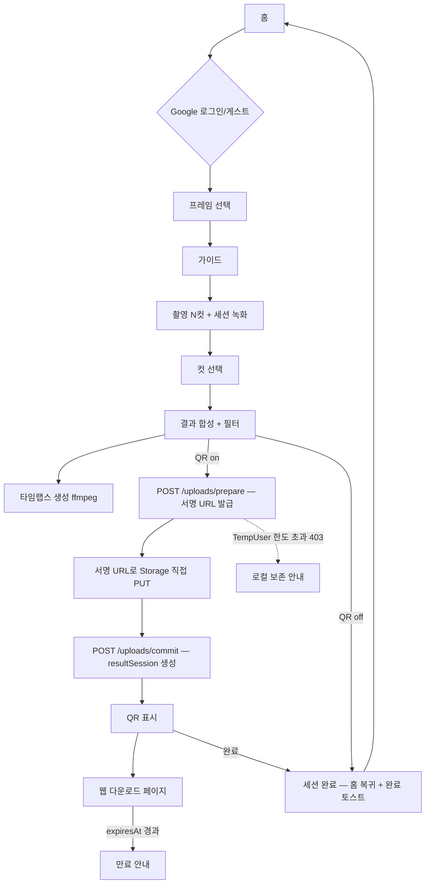

# 00 · 전체 개요 & 아키텍처

| 항목 | 값 |
|------|-----|
| 문서 | MC포토 시스템 전체 개요·아키텍처(진입 문서) |
| 범위 | 4계층(Exe 앱 / 백엔드 API / 웹 / Firebase 인프라) 조감, 컴포넌트 맵, end-to-end 데이터 흐름, 문서 지도 |
| 최종 업데이트 | 2026-07-30 (멀티플랫폼 클라이언트 문서 계층 반영 — §5 문서 지도 갱신) |
| 관련 소스 | 저장소 전역(`src/`, `web/`, `docs/`) |
| 갱신 규칙 | 컴포넌트/흐름/스택이 바뀌면 이 문서와 해당 세부 문서를 함께 갱신 |

> 이 문서는 **지도**입니다. 세부는 각 영역 문서를 참조하세요(맨 아래 [문서 지도](#5-문서-지도)).
>
> 🆕 **iOS·iPadOS·Android·macOS·웹 클라이언트를 새로 만든다면** 이 문서로 전체 그림을 잡은 뒤 **[05 · 멀티플랫폼 클라이언트 개발 가이드](./05-cross-platform-client-guide.md)** 로 이동하세요. 아래 §2·§4의 "Exe 앱"은 **현재 유일한 클라이언트 구현(Windows 데스크톱)** 을 뜻하며, 시스템이 요구하는 것은 그 특정 기술 스택이 아니라 §6의 불변식과 백엔드 계약입니다.

---

## 1. 시스템 개요

MC포토는 **키오스크형 셀프 포토부스**로, 4개 부분으로 구성됩니다.

| 구성 | 역할 | 기술 |
|------|------|------|
| **Exe 앱**(WPF 데스크톱) | 촬영·프레임·합성·필터·타임랩스·QR 표시. 현장 키오스크 본체. | .NET 8, WPF, OpenCvSharp, ffmpeg |
| **백엔드 API**(Cloud Functions) | 앱의 모든 DB/Storage 접근을 대행. 인증(JWT)·권한·업로드 서명 URL·프레임/계정 CRUD·TempUser 한도. **Admin 권한은 여기에만 존재**. | Cloud Functions 2nd gen, TypeScript, Express, Admin SDK(ADC) |
| **Firebase 인프라** | 결과물 파일(Storage), 세션 메타/프레임/계정(Firestore), 보관/만료(Lifecycle·TTL). | Cloud Firestore, Cloud Storage |
| **웹 페이지** | QR로 접속해 사진·타임랩스 다운로드. 만료/부재 안내. | Firebase Hosting + Firestore/Storage(바닐라 JS) |

> it15에서 **앱의 Admin SDK 직결(`MCPhoto.Firebase`)이 폐지**됐습니다. 앱은 배포 게이트 키(`X-MCPhoto-Client`)와 로그인 JWT로 백엔드 API를 호출하며, 서비스 계정 키를 갖지 않습니다. 상세는 [30 · 백엔드 연동](./30-backend-firebase-integration.md).

핵심 사용자 흐름: **현장에서 촬영 → 앱이 합성/업로드 → QR 발급 → 손님이 휴대폰으로 QR 스캔 → 웹에서 다운로드 → 보관시간 경과 후 자동 만료.**

## 2. 컴포넌트 맵

```
┌─────────────────────────── Exe 앱 (MCPhoto.App) ───────────────────────────┐
│  Views/ViewModels (MVVM)  ·  AppShellViewModel(상태머신)  ·  DI(Host)        │
│         │ 카메라·합성                     │ 업로드·QR            │ 설정·프레임   │
└─────────┼──────────────────────────────┼────────────────────┼──────────────┘
          ▼                              ▼                    ▼
   MCPhoto.Capture                MCPhoto.Http           MCPhoto.Core
   (OpenCvSharp 카메라,         (백엔드 HTTPS API        (도메인 모델, 설정 INI,
    ffmpeg 녹화/타임랩스,        클라이언트: 업로드·      브랜딩, 내비게이션,
    합성, 필터)                  프레임·계정·한도,        업로드 오케스트레이션·
          │                      JWT 세션 홀더)          QR, 계약 인터페이스)
          ▼                              │
     ffmpeg.exe                          │ HTTPS (X-MCPhoto-Client + Bearer JWT)
                                         ▼
                           백엔드 API (web/functions — Cloud Functions 2nd gen)
                           /auth /accounts /config /frames /uploads /health
                                         │ Admin SDK(ADC)
                                         ▼
                              Firebase(Firestore + Storage)
                                         │        ▲
                                         │        └── 파일 바이트는 앱이 서명 URL로 직접 PUT
                                         ▼
                                   웹 다운로드 페이지 (web/public)  ◀── 손님 QR 스캔
```

- 의존 방향: `MCPhoto.App` → (`Capture`, `Http`, `Core`), 그리고 `Capture`/`Http` → `Core`. **Core는 아무것에도 의존하지 않는 도메인 계층**(계약·모델·순수 로직). 세부: [10-exe-app-architecture](./10-exe-app-architecture.md).
- 파일 바이트는 백엔드 함수를 경유하지 않는다 — 앱이 `/uploads/prepare`로 받은 **V4 서명 URL로 Storage에 직접 PUT**한다([30 §5](./30-backend-firebase-integration.md)).
- 테스트: `tests/MCPhoto.Tests`(단위 + headless XAML 회귀, 721개) + `web/functions`(Jest) + `web`(규칙 Emulator 테스트).

## 3. end-to-end 데이터 흐름 (촬영 1회)



- 촬영/합성/타임랩스 세부: [11-exe-app-features](./11-exe-app-features.md), 캡처 파이프라인 구조: [10-exe-app-architecture](./10-exe-app-architecture.md).
- 업로드·QR·문서 생성: [30-backend-firebase-integration](./30-backend-firebase-integration.md), 스키마·경로: [40-database-firestore-and-storage-schema](./40-database-firestore-and-storage-schema.md).
- 웹 표시·만료 판정: [20-frontend-web-download-page](./20-frontend-web-download-page.md), 물리 삭제(만료): [50-infra-gcp-lifecycle-and-ttl](./50-infra-gcp-lifecycle-and-ttl.md).

## 4. 기술 스택 요약

| 계층 | 스택 |
|------|------|
| Exe 앱 | .NET 8 / WPF / CommunityToolkit.Mvvm / Microsoft.Extensions.Hosting(DI) / Serilog |
| 영상·이미지 | OpenCvSharp4.Windows / ffmpeg(번들) |
| 앱↔백엔드 | `IHttpClientFactory`(명명 클라이언트 `backend`) / 배포 게이트 키 `X-MCPhoto-Client` + JWT Bearer / QRCoder |
| 백엔드 API | Cloud Functions 2nd gen(asia-northeast3) / TypeScript / Express / firebase-admin(ADC) / Secret Manager |
| 인증 | Google SSO(시스템 브라우저 + loopback + PKCE) → 서버 발급 JWT(HS256, 기본 8시간) |
| 웹 | Firebase Hosting + Firestore + Storage(vanilla JS) |
| 인프라 | GCP: GCS Object Lifecycle, Firestore 네이티브 TTL |

## 5. 문서 지도

**진입 · 플랫폼 중립 규격** (새 클라이언트의 진실원)

| # | 문서 | 내용 |
|---|------|------|
| 00 | (이 문서) | 전체 개요·아키텍처·데이터 흐름 |
| **05** | [cross-platform-client-guide](./05-cross-platform-client-guide.md) | 멀티플랫폼 진입 — 용어·프로파일·지원 매트릭스·불변식·서버 블로커 |
| **13** | [client-behavior-spec](./13-client-behavior-spec.md) | 화면·상태 전이·흐름·타이밍 상수·검증·사용자 문구 |
| **14** | [media-pipeline-spec](./14-media-pipeline-spec.md) | 카메라·크롭·슬롯 기하·합성·필터·녹화/타임랩스 알고리즘 |
| **31** | [backend-api-reference](./31-backend-api-reference.md) | 전 엔드포인트 요청/응답·상태코드·에러 코드·입력 검증 |
| **41** | [local-data-and-file-formats](./41-local-data-and-file-formats.md) | 설정 키·프레임 파일 포맷·세션 작업 공간·플랫폼별 저장 위치 |
| **61** | [auth-platform-integration](./61-auth-platform-integration.md) | 플랫폼별 OAuth·JWT 규약·PIN 게이트 |

**공통 규격**

| # | 문서 | 내용 |
|---|------|------|
| 30 | [backend-firebase-integration](./30-backend-firebase-integration.md) | 백엔드 연동 설계 의도(인증 모델·업로드 3단계·한도·미도달 정책) |
| 40 | [database-firestore-and-storage-schema](./40-database-firestore-and-storage-schema.md) | Firestore/Storage 스키마·경로·보안규칙 |
| 50 | [infra-gcp-lifecycle-and-ttl](./50-infra-gcp-lifecycle-and-ttl.md) | GCP 보관/만료(Lifecycle·TTL)·비용 |
| 60 | [auth-accounts-and-roles](./60-auth-accounts-and-roles.md) | 역할 위계·권한 매트릭스 |
| 90 | [roadmap-and-future-work](./90-roadmap-and-future-work.md) | 알려진 이슈·개선 예정·비범위 |

**구현 참조** (특정 클라이언트 — 예시·근거·이력)

| # | 문서 | 대상 | 내용 |
|---|------|------|------|
| 10 | [exe-app-architecture](./10-exe-app-architecture.md) | Windows 전용 | 솔루션 구조·MVVM·DI·상태머신·캡처 파이프라인 |
| 11 | [exe-app-features](./11-exe-app-features.md) | Windows 전용 | 기능 상세(촬영·프레임·필터·QR·타임랩스·유휴 등) |
| 12 | [exe-app-settings-and-config](./12-exe-app-settings-and-config.md) | Windows 전용 | 설정 INI·기본값·브랜딩·표시 모드 |
| 20 | [frontend-web-download-page](./20-frontend-web-download-page.md) | 웹(소비자) | 다운로드 페이지·만료 판정 |
| 70 | [logging-and-troubleshooting](./70-logging-and-troubleshooting.md) | Windows 전용 | 로그 위치·증상별 진단 가이드 |
| 80 | [build-and-deployment](./80-build-and-deployment.md) | Windows 전용 | 빌드·단일 EXE 배포·ffmpeg 번들 |

## 6. 핵심 원칙(불변식) 요약

- **앱에 Admin 권한 없음**: 앱은 서비스 계정 키를 갖지 않는다. DB/Storage 쓰기는 전부 백엔드가 대행하고, 파일만 서버가 발급한 **경로·Content-Type이 고정된 서명 URL**로 올린다. ([30 §3](./30-backend-firebase-integration.md))
- **오프라인 안전(축 재정의)**: 백엔드에 도달하지 못하면 로그인·업로드·QR은 실패하지만 **게스트 촬영과 로컬 저장은 계속 동작**한다(오프라인 로그인 폴백 없음). ([30 §11](./30-backend-firebase-integration.md), [60 §4.5](./60-auth-accounts-and-roles.md))
- **권한은 서버가 재검증**: 클라가 보낸 역할·소유자·`isDefault`를 신뢰하지 않고 JWT의 role로 판정한다. ([30 §3.1](./30-backend-firebase-integration.md), [60](./60-auth-accounts-and-roles.md))
- **과금 안전은 서버가 진실원**: TempUser QR 한도는 prepare에서 선검사(서명 URL 미발급) + commit 트랜잭션에서 재검사·카운트 증가. 앱 판정은 표시용이며 조회 실패는 fail-open. ([30 §6](./30-backend-firebase-integration.md))
- **성공 오인 금지**: 저장/삭제/업로드 실패를 조용히 넘기지 않고 사용자에게 안내. ([12](./12-exe-app-settings-and-config.md), [30 §5.4](./30-backend-firebase-integration.md))
- **크래시 대신 복구**: 전역 예외는 로그 + 홈 복귀. ([10](./10-exe-app-architecture.md), [70](./70-logging-and-troubleshooting.md))
- **유휴 시 로그아웃 없음**: 무동작 → 홈 복귀만, 세션 계정 유지. 반대로 **로그아웃 시에는 JWT를 반드시 폐기**한다(게스트 촬영이 직전 계정으로 기록되는 것을 막는 불변식). ([60](./60-auth-accounts-and-roles.md), [30 §3.1](./30-backend-firebase-integration.md))
- **만료 2축**: 접근 만료(`expiresAt`, 웹 차단)와 물리 삭제(GCS age 3일 · Firestore TTL)는 별개. 앱·서버 모두 만료 정리 코드를 호출하지 않는다(인프라 담당). ([50](./50-infra-gcp-lifecycle-and-ttl.md), [30 §10](./30-backend-firebase-integration.md))
