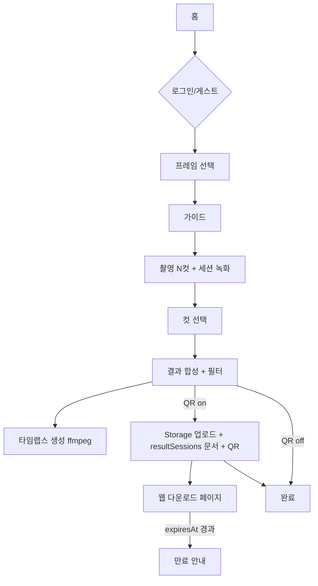

# 00 · 전체 개요 & 아키텍처

| 항목 | 값 |
|------|-----|
| 문서 | MC포토 시스템 전체 개요·아키텍처(진입 문서) |
| 범위 | 3계층(Exe 앱 / 웹 / Firebase) 조감, 컴포넌트 맵, end-to-end 데이터 흐름, 문서 지도 |
| 최종 업데이트 | 2026-07-23 |
| 관련 소스 | 저장소 전역(`src/`, `web/`, `docs/`) |
| 갱신 규칙 | 컴포넌트/흐름/스택이 바뀌면 이 문서와 해당 세부 문서를 함께 갱신 |

> 이 문서는 **지도**입니다. 세부는 각 영역 문서를 참조하세요(맨 아래 [문서 지도](#5-문서-지도)).

---

## 1. 시스템 개요

MC포토는 **키오스크형 셀프 포토부스**로, 3개 부분으로 구성됩니다.

| 구성 | 역할 | 기술 |
|------|------|------|
| **Exe 앱**(WPF 데스크톱) | 촬영·프레임·합성·필터·타임랩스·QR 표시. 현장 키오스크 본체. | .NET 8, WPF, OpenCvSharp, ffmpeg |
| **Firebase 백엔드** | 결과물 업로드(Storage), 세션 메타/프레임/계정(Firestore), 만료 관리. | Firestore, Cloud Storage, Admin SDK |
| **웹 페이지** | QR로 접속해 사진·타임랩스 다운로드. 만료/부재 안내. | Firebase Hosting + Firestore/Storage(바닐라 JS) |

핵심 사용자 흐름: **현장에서 촬영 → 앱이 합성/업로드 → QR 발급 → 손님이 휴대폰으로 QR 스캔 → 웹에서 다운로드 → 보관시간 경과 후 자동 만료.**

## 2. 컴포넌트 맵

```
┌─────────────────────────── Exe 앱 (MCPhoto.App) ───────────────────────────┐
│  Views/ViewModels (MVVM)  ·  AppShellViewModel(상태머신)  ·  DI(Host)        │
│         │ 카메라·합성                     │ 업로드·QR            │ 설정·프레임   │
└─────────┼──────────────────────────────┼────────────────────┼──────────────┘
          ▼                              ▼                    ▼
   MCPhoto.Capture              MCPhoto.Firebase        MCPhoto.Core
   (OpenCvSharp 카메라,         (Firestore/Storage,     (도메인 모델, 설정 INI,
    ffmpeg 녹화/타임랩스,        업로드, 프레임/계정      브랜딩, 내비게이션,
    합성, 필터)                  저장소, QR)             계약 인터페이스)
          │                              │
          ▼                              ▼
     ffmpeg.exe                   Firebase(Firestore + Storage)
                                          │
                                          ▼
                                   웹 다운로드 페이지 (web/)  ◀── 손님 QR 스캔
```

- 의존 방향: `MCPhoto.App` → (`Capture`, `Firebase`, `Core`), 그리고 `Capture`/`Firebase` → `Core`. **Core는 아무것에도 의존하지 않는 도메인 계층**(계약·모델·순수 로직). 세부: [10-exe-app-architecture](./10-exe-app-architecture.md).
- 테스트: `tests/MCPhoto.Tests`(단위 + headless XAML 회귀, 268개).

## 3. end-to-end 데이터 흐름 (촬영 1회)



- 촬영/합성/타임랩스 세부: [11-exe-app-features](./11-exe-app-features.md), 캡처 파이프라인 구조: [10-exe-app-architecture](./10-exe-app-architecture.md).
- 업로드·QR·문서 생성: [30-backend-firebase-integration](./30-backend-firebase-integration.md), 스키마·경로: [40-database-firestore-and-storage-schema](./40-database-firestore-and-storage-schema.md).
- 웹 표시·만료 판정: [20-frontend-web-download-page](./20-frontend-web-download-page.md), 물리 삭제(만료): [50-infra-gcp-lifecycle-and-ttl](./50-infra-gcp-lifecycle-and-ttl.md).

## 4. 기술 스택 요약

| 계층 | 스택 |
|------|------|
| Exe 앱 | .NET 8 / WPF / CommunityToolkit.Mvvm / Microsoft.Extensions.Hosting(DI) / Serilog |
| 영상·이미지 | OpenCvSharp4.Windows / ffmpeg(번들) |
| 백엔드 | Google.Cloud.Firestore / Firebase Admin(Storage) / QRCoder |
| 웹 | Firebase Hosting + Firestore + Storage(vanilla JS) |
| 인프라 | GCP: GCS Object Lifecycle, Firestore 네이티브 TTL |

## 5. 문서 지도

| # | 문서 | 내용 |
|---|------|------|
| 00 | (이 문서) | 전체 개요·아키텍처·데이터 흐름 |
| 10 | [exe-app-architecture](./10-exe-app-architecture.md) | WPF 구조·MVVM·DI·상태머신·캡처 파이프라인 |
| 11 | [exe-app-features](./11-exe-app-features.md) | 기능 상세(촬영·프레임·필터·QR·타임랩스·유휴 등) |
| 12 | [exe-app-settings-and-config](./12-exe-app-settings-and-config.md) | 설정(AppSettings/INI)·기본값·브랜딩 |
| 20 | [frontend-web-download-page](./20-frontend-web-download-page.md) | 웹 다운로드 페이지·만료 판정 |
| 30 | [backend-firebase-integration](./30-backend-firebase-integration.md) | Firebase 초기화·업로드·프레임/계정·QR |
| 40 | [database-firestore-and-storage-schema](./40-database-firestore-and-storage-schema.md) | Firestore/Storage 스키마·경로·보안규칙 |
| 50 | [infra-gcp-lifecycle-and-ttl](./50-infra-gcp-lifecycle-and-ttl.md) | GCP 보관/만료(Lifecycle·TTL)·비용 |
| 60 | [auth-accounts-and-roles](./60-auth-accounts-and-roles.md) | 로그인·계정·역할 권한 매트릭스 |
| 70 | [logging-and-troubleshooting](./70-logging-and-troubleshooting.md) | 로그 위치·증상별 진단 가이드 |
| 80 | [build-and-deployment](./80-build-and-deployment.md) | 빌드·단일 EXE 배포·ffmpeg 번들 |
| 90 | [roadmap-and-future-work](./90-roadmap-and-future-work.md) | 알려진 이슈·개선 예정·비범위 |

## 6. 핵심 원칙(불변식) 요약

- **오프라인 안전**: Firebase 서비스 계정 키가 없으면 `IsInitialized=false`로 업로드·QR만 비활성, 앱은 크래시 없이 동작(로컬 저장 가능). ([30](./30-backend-firebase-integration.md))
- **성공 오인 금지**: 저장/삭제/업로드 실패를 조용히 넘기지 않고 사용자에게 안내. ([12](./12-exe-app-settings-and-config.md), [30](./30-backend-firebase-integration.md))
- **크래시 대신 복구**: 전역 예외는 로그 + 홈 복귀. ([10](./10-exe-app-architecture.md), [70](./70-logging-and-troubleshooting.md))
- **유휴 시 로그아웃 없음**: 무동작 → 홈 복귀만, 세션 계정 유지. ([60](./60-auth-accounts-and-roles.md))
- **만료 2축**: 접근 만료(`expiresAt`, 웹 차단)와 물리 삭제(GCS age 3일 · Firestore TTL)는 별개. ([50](./50-infra-gcp-lifecycle-and-ttl.md))
